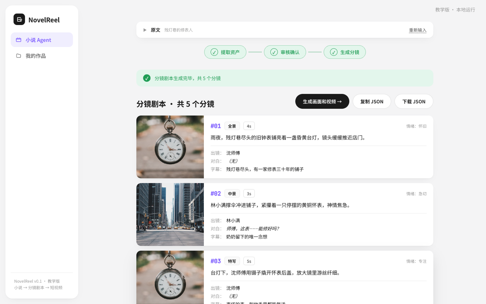

<div align="center">

# 🎬 NovelReel

### 把一段小说，一条龙变成推文短视频

**小说 → 分镜剧本 → 角色图 / 分镜图 → 视频片段 → 成片**

对标剪映「小云雀」，同时是一个**面向零基础学员的 AI 编排教学项目**——
用**明文 Python** 复刻三层 Agent 编排范式，编排逻辑能逐行读懂，不藏在任何框架黑盒里。

<br>


</div>

---

<div align="center">
  
  <br>
  <em>工作台首页 —— 贴一段小说，点「开始处理」，AI 自动找出角色 / 场景 / 道具并拆成分镜</em>
</div>

<br>

## ✨ 它能做什么

输入一段中文小说（≤ 4000 字），自动一路产出到成片：

| 阶段 | 产物 | 用的模型 |
|------|------|---------|
| **P0 · 文本闭环** | 角色 / 场景 / 道具 → 分镜剧本 JSON | 豆包 LLM |
| **P1 · 生图** | 每个角色的设计图 + 每个分镜的画面图（角色跨镜保持一致） | 豆包 Seedream |
| **P2 · 生视频** | 每个分镜的视频片段 → ffmpeg 合成一条成片 | 豆包 Seedance |

> 💡 **没配密钥也能完整跑通**——生图 / 生视频会自动降级成占位图 / 占位视频，整条流水线照样从头跑到成片，方便先看效果、上课演示。配上火山引擎豆包密钥，出的就是真实画面。

---

## 🎞 跑出来长什么样

贴完小说，AI 拆出的**分镜剧本**就是这个样子——每个镜头都带画面、景别、时长、台词、字幕和情绪标签，可以直接复制 / 下载 JSON，也可以一键往下「生成画面和视频」：

<div align="center">
  
  <br>
  <em>分镜剧本页 —— 顶部「提取资产 → 审核确认 → 生成分镜」步骤条，下方是逐镜卡片</em>
</div>

<br>

完整体验路径（页面上点点点即可）：

```
贴小说  →  开始处理  →  审核角色/场景/道具（可改可跳过）
        →  看分镜剧本  →  生成画面和视频  →  成片播放
```

---

## 🧠 核心范式：三层编排（明文 Python 状态机）

本项目借鉴开源项目 **ArcReel** 的「三层 Agent 编排」思路，但**不依赖任何 Agent 框架**（不用 Claude Agent SDK / LangGraph / CrewAI），整套编排就是一个你能逐行读懂的 Python 状态机。

```
┌──────────────────────────────────────────────────┐
│  编排器 orchestrator（大脑 · 明文状态机）          │
│  检测 project.json 状态 → 决定下一步 → 派 Subagent  │
│  ★ 不读小说原文、不调模型，只做决策 ★              │
└──────┬─────────────────────────────────────────────┘
       │ dispatch（只传文件路径，不传原文）
       ▼
   6 个单一职责 Subagent
    ① 提取资产   ② 生成剧本   ③ 画角色图
    ④ 画分镜图   ⑤ 生成视频   ⑥ 合成成片
       │ 调用
       ▼
   模型客户端层： LLM(豆包) · 图(Seedream) · 视频(Seedance)
       └── 没密钥自动降级占位，绝不中断流水线
```

**四条落地的设计原则：**

| 原则 | 含义 | 带来的好处 |
|------|------|-----------|
| **重上下文任务隔离** | 啃小说原文的活在 Subagent 里，编排器只持有状态摘要 | 上下文永不爆 |
| **数据状态驱动** | 下一步做什么，完全由 `project.json` 字段填没填决定 | 天然支持**断点续传** |
| **决策与执行分离** | 编排器只决策，Subagent 只执行 | 可复用、可单测 |
| **一致性靠数据结构** | 角色定义只存一处，画分镜时把角色设计图作参考传入 | 同一角色跨镜不串脸 |

> 📖 想看完整的数据流时序图、文件地图和逐节课拆解 → [docs/ARCHITECTURE.md](docs/ARCHITECTURE.md)

---

## 🚀 快速开始

> 前置：[uv](https://docs.astral.sh/uv/)（Python 包管理器）；P2 合成成片还需要 [ffmpeg](https://ffmpeg.org/)（macOS：`brew install ffmpeg`）。

```bash
# 1. 安装依赖（含测试依赖）
uv sync --extra dev

# 2. 跑测试（纯本地 mock，不联网不花钱，秒过）
uv run pytest
```

接着二选一启动 👇

**🅰️ 演示模式 —— 零密钥，立刻看完整效果**

```bash
uv run python scripts/seed_demo_projects.py   # 可选：先灌 3 个演示项目
uv run python scripts/serve_demo.py           # 假 LLM + 占位图，无需任何密钥
#   → 浏览器打开 http://127.0.0.1:8000
```

**🅱️ 真实模式 —— 配火山引擎豆包密钥，出真实画面**

```bash
cp .env.example .env                          # 填入 NOVELREEL_LLM_API_KEY
uv run python scripts/check_llm.py            # 先验证密钥连通
uv run uvicorn novelreel.api:app --reload     # 启动
#   → 浏览器打开 http://127.0.0.1:8000
```

> 密钥在火山引擎方舟控制台获取：<https://console.volcengine.com/ark>。生图 / 生视频默认复用同一个 LLM 密钥，留空相关变量即可。

---

## 🛠 技术栈

| 层 | 选型 |
|----|------|
| 后端 / 编排 | **Python 3.11+** · **FastAPI**（耗时活儿丢 `BackgroundTasks` 后台跑） |
| 文本模型 | **OpenAI SDK** 调豆包（火山引擎 OpenAI 兼容接口） |
| 图 / 视频 | **httpx** 调 Seedream 生图 · Seedance 异步生视频 |
| 降级 / 合成 | **Pillow** 生成占位图 · **ffmpeg** 合成成片 |
| 数据建模 | **Pydantic**（模型与校验） |
| 前端 | 纯 **HTML + 原生 JS** 单页（不上框架、无构建步骤） |

---

## 📁 目录结构

```
src/novelreel/
├── core/
│   ├── models.py          # Pydantic 数据模型（地基）
│   ├── project_manager.py # 项目目录与 project.json 读写
│   ├── config.py          # 模型接入配置（读 .env）
│   ├── llm.py             # 豆包文本客户端
│   ├── imagegen.py        # 豆包 Seedream 生图客户端（带占位降级）
│   ├── videogen.py        # 豆包 Seedance 生视频客户端（异步 + 降级）
│   ├── compose.py         # ffmpeg 合成
│   └── orchestrator.py    # ★ 编排器：明文 Python 状态机 ★
├── agents/                # 6 个单一职责 Subagent + prompts.py
└── api.py                 # FastAPI 接口
web/                       # 单页前端（index.html）+ 占位素材
scripts/                   # serve_demo / check_llm / seed_demo_projects
samples/ · tests/ · docs/  # 样例小说 / 44 个测试 / 文档
```

---

## 📚 文档

| 文档 | 内容 |
|------|------|
| [docs/ARCHITECTURE.md](docs/ARCHITECTURE.md) | 架构讲解：三层编排、数据流时序图、文件地图、7 节课拆解 |
| [docs/PRD.md](docs/PRD.md) | 产品需求文档（功能分期、数据模型、验收标准） |
| [docs/DESIGN.md](docs/DESIGN.md) | 前端设计规范（小云雀同款工作台风） |
| [CHANGELOG.md](CHANGELOG.md) | 版本变更记录 |

---

## 🎓 教学定位

这是一个「麻雀虽小五脏俱全」的真实 AI 工程项目，覆盖 **LLM 调用 · 多 Agent 编排 · 数据状态管理 · 异步任务 · API 设计 · 前端展示**。课程沿「从最薄骨架、每节课加一层肉」推进，共 **7 节**，每节课结束学员都能跑出新功能看到效果（详见 ARCHITECTURE.md）。

> **关键约束**：编排器保持明文极简、**禁用 Agent 框架**——因为编排不能是黑盒，学员要能逐行读懂、改得动。

---

## 📄 开源协议

本项目以 **[MIT License](LICENSE)** 开源（Copyright © 2026 diaojz），可自由使用、修改、分发、商用。

关于和参考项目 **ArcReel** 的关系，需要说明清楚：

- 本项目**只借鉴了 ArcReel 的「三层 Agent 编排」设计思路**，代码为**全部自研实现**，**与 ArcReel 无任何代码继承 / 复制关系**。
- ArcReel 本身采用 **AGPL-3.0** 协议；由于本项目不包含其任何源码，因此不受 AGPL-3.0 的传染性条款约束，得以采用更宽松的 MIT。
- 演示用的占位图来自 [Unsplash](https://unsplash.com/)（可商用、无需署名）。

> ⚠️ 如果你后续向本项目**直接引入了 ArcReel 或其他 AGPL/GPL 代码**，许可证义务会随之改变——届时请重新评估 LICENSE，别让 MIT 声明与实际依赖不符。
