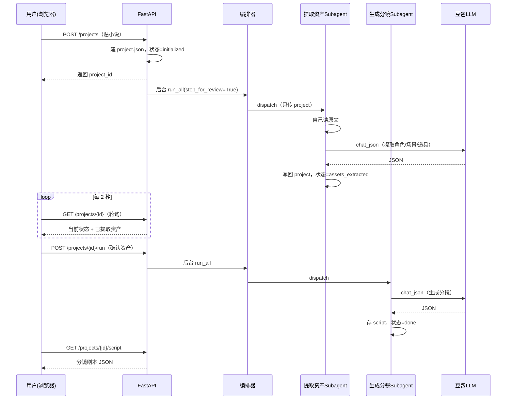

# NovelReel 架构讲解（教学用）

这份文档讲清楚 NovelReel 是怎么搭起来的。读完你应该能回答：
**「一段小说，是怎么一步步变成分镜剧本的？」**

---

## 一、整体架构：三层编排

NovelReel 借鉴了开源项目 ArcReel 的「三层 Agent 编排」范式，但用**最朴素的 Python** 重写，没有任何 Agent 框架——因为编排逻辑要能在课堂上逐行讲清楚。

```
┌──────────────────────────────────────────────┐
│  前端 index.html（浏览器）                     │
│  贴小说 → 轮询状态 → 看资产 → 看分镜           │
└───────────────────┬──────────────────────────┘
                    │ HTTP（4 个接口）
┌───────────────────▼──────────────────────────┐
│  api.py（FastAPI）                             │
│  建项目 / 触发编排 / 查状态 / 取剧本           │
│  耗时活儿丢 BackgroundTasks 后台跑             │
└───────────────────┬──────────────────────────┘
                    │ 调用
┌───────────────────▼──────────────────────────┐
│  orchestrator.py（编排器 = 大脑，明文状态机）  │
│  检测状态 → 决定下一步 → dispatch Subagent     │
│  ★ 不读原文、不调 LLM，只做决策 ★              │
└──────┬──────────────────────┬─────────────────┘
       │ dispatch             │ dispatch
┌──────▼───────────┐   ┌──────▼────────────────┐
│ extract_assets   │   │ generate_script        │
│ 提取角色/场景/道具 │   │ 生成分镜剧本           │
│ （自己读原文）    │   │ （读资产+原文）        │
└──────┬───────────┘   └──────┬────────────────┘
       │ 调用                  │ 调用
┌──────▼──────────────────────▼─────────────────┐
│  llm.py（豆包客户端，OpenAI 兼容）             │
│  chat() 纯文本 / chat_json() 结构化 JSON       │
└───────────────────────────────────────────────┘

         所有数据落盘在 projects/<id>/project.json
```

---

## 二、四个核心设计原则（从 ArcReel 学来）

### 1. 重上下文任务隔离
小说原文可能几千字。如果塞进编排器，几轮就把上下文撑爆。
所以**编排器从不读原文**，只把 `project` 传给 Subagent，由 Subagent 调
`ProjectManager.read_novel()` 自己读。编排器手里永远只有「状态摘要」。

> 看代码：`orchestrator.advance()` 全程没出现 `read_novel`，而
> `extract_assets.run()` 第一行就是 `pm.read_novel(project)`。

### 2. 数据状态驱动工作流
「下一步做什么」完全由 `project.json` 里的字段决定，不靠内存变量：

```python
if not project.has_assets:        # 还没提取 → 提取
    return extract_assets.run(...)
if not project.script_path:       # 没剧本 → 生成
    return generate_script.run(...)
project.status = DONE             # 都有了 → 完成
```

好处：**天然断点续传**。任何一步崩了，重新调 `advance()`，它读一下
project.json 就知道该从哪继续，不会重复调 LLM。

### 3. 决策与执行分离
- 编排器只**决策**（该跑哪个 Subagent），不碰原文、不调 LLM。
- Subagent 只**执行**（读原文、调 LLM、写回数据），干完返回结构化摘要
  （`AgentResult`：DONE / BLOCKED / ERROR）。

这样执行器可复用、可单独测试，决策逻辑也清爽。

### 4. 一致性靠数据结构
角色 / 场景 / 道具的完整定义**只存 project.json 一处**，分镜剧本里只引用名字。
改一处全局生效，不会出现「第 1 镜和第 5 镜里同一个角色描述不一样」。

---

## 三、一次完整的数据流



---

## 四、文件地图

| 文件 | 职责 | 对应课程 |
|------|------|---------|
| `core/models.py` | Pydantic 数据模型（地基） | 第 2 节 |
| `core/project_manager.py` | 项目目录与 project.json 读写 | 第 2 节 |
| `core/config.py` + `core/llm.py` | 豆包客户端、配置 | 第 1 节 |
| `agents/prompts.py` | 提示词集中存放 | 第 3-4 节 |
| `agents/extract_assets.py` | Subagent①：提取资产 | 第 3 节 |
| `agents/generate_script.py` | Subagent②：生成分镜 | 第 4 节 |
| `core/orchestrator.py` | 编排器（状态机大脑） | 第 5 节 |
| `api.py` | FastAPI 接口 | 第 6 节 |
| `web/index.html` | 前端单页 | 第 6 节 |

---

## 五、怎么跑起来

```bash
# 装依赖
uv sync --extra dev

# 跑测试（不调真实 LLM，纯本地，秒过）
uv run pytest

# 方式 A：演示模式（假 LLM，无需密钥，立刻看效果）
uv run python scripts/serve_demo.py
# 浏览器开 http://127.0.0.1:8000

# 方式 B：真实模式（配好 .env 的豆包密钥）
cp .env.example .env   # 填入 NOVELREEL_LLM_API_KEY
uv run python scripts/check_llm.py        # 先验证密钥通了
uv run uvicorn novelreel.api:app --reload # 启动
```

---

## 六、P1 / P2 已实现：从文字到视频成片

P0（文本闭环）之上，P1（生图）和 P2（生视频+合成）都已落地，编排器靠
`run_all(target=...)` 控制跑到哪一步：

| target | 跑到哪 | 新增 Subagent |
|--------|--------|--------------|
| `script`（默认） | 分镜剧本（P0） | — |
| `storyboard` | 分镜图（P1） | draw_characters③ + draw_shots④ |
| `video` | 视频成片（P2） | make_clips⑤ + compose_video⑥ |

- **P1 角色一致性**：先给每个角色生成 sheet 图（`draw_characters`），画分镜图时把
  出镜角色的 sheet 图作为**参考图**传给 Seedream（`draw_shots`），保证同一角色
  跨镜一致 —— 这就是 ArcReel「固化+引用」范式的落地。
- **P2 异步视频**：`VideoClient` 走 Seedance 异步任务（提交→轮询→取 url），
  `make_clips` 用分镜图作起始帧逐镜生成，`compose_video` 用 ffmpeg 拼成成片。
- **优雅降级**：生图/生视频客户端没配密钥或失败时自动降级（占位图 / ffmpeg 转
  静态占位视频），所以**没有媒体密钥也能把整条 P0→P1→P2 流水线跑通看效果**，
  配上豆包密钥就是真实画面。

模型客户端（`imagegen.py` / `videogen.py`）是独立一层，换模型只改配置；
每个 Subagent 即插即用；编排器加一个状态判断就把新步骤接进了流水线 ——
扩展性在这次 P1/P2 落地中得到了验证。
